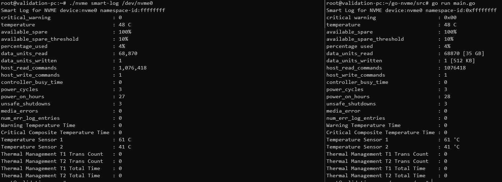

## go-nvme



ref
- [nvme-cli](https://github.com/linux-nvme/nvme-cli)
- [go smart library](https://github.com/dswarbrick/smart)

### ENV
- `go env -w GO111MODULE=off`
- go version go1.16.2 linux/amd64 


### RUN

```bash
$ go run src/main.go
```